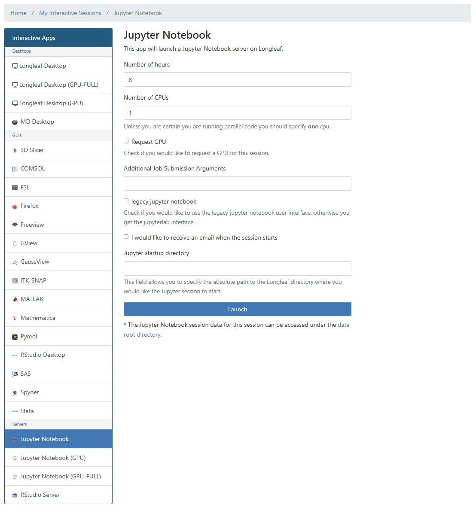
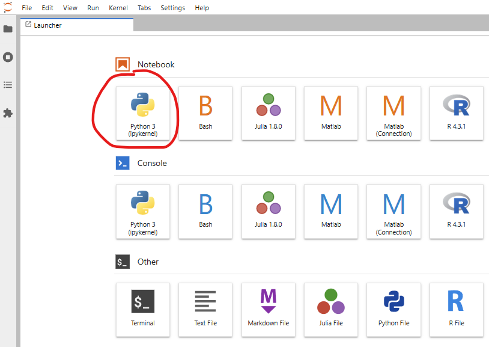
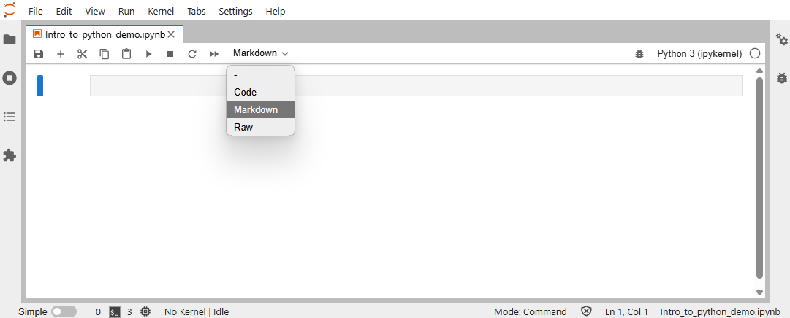
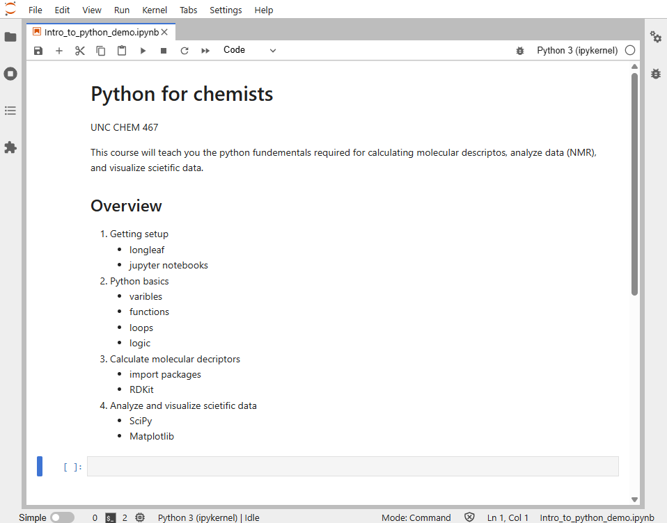
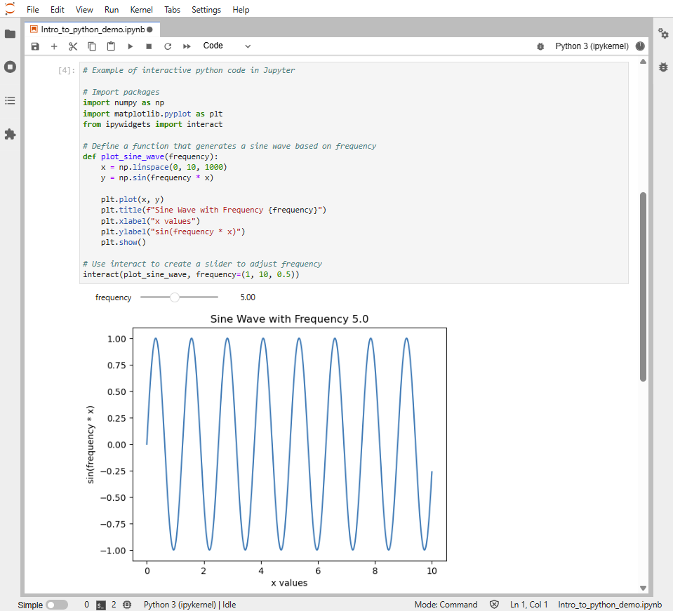

# Getting started with Longleaf (UNC research computing)

The Longleaf cluster is a Linux-based computing system available to researchers at UNC free of charge. In this course we will use Longleaf to run Python code in Jupyter notebooks.

<div class="alert alert-block alert-info">
<h2>Glossary:</h2>

**Python:** a popular computer language for science, data science, and general use.

**Jupyter notebook:** an interactive environment that can display notes (markdown), run python code, and display the output of code.

**Longleaf:** UNC research computing compute cluster. (aka: a super computer accessible to UNC researchers)

**Longleaf On Demand:** a user-friendly web-portal that provides a graphical interface for apps including Jupyter.

</div>

## Request a Longleaf account

Request an account by following these steps.

1) Go to [help.unc.edu](https://help.unc.edu) and log in with your onyen.
2) Search for **Compute Cluster Access** in the catalog section of [help.unc.edu](https://help.unc.edu).
3) Click on **Computer Cluster Access**.
4) Click "Request Access" to complete the service request form and submit.

    


You will be notified by email when your account is ready.

## Access Jupyter via Longleaf On Demand

Once your account is approved you will be able to access Longleaf. There are many ways to access Longleaf but for this course we will be using Longleaf On-Demand.

1) Got to [https://ondemand.rc.unc.edu/pun/sys/dashboard](https://ondemand.rc.unc.edu/pun/sys/dashboard).
2) Sign in using your onyen. 
3) Click on "Jupyter Notebook"
4) Request resources and click "Launch".

    

5) Wait for computing resources to be allocated (~1 minute).
6) Click "Connect to Jupyter".
7) In the **Launcher** and under the section labeled **Notebook**, click "Python3 (ipkernel)" to open a notebook running Python.

    

## Setting up your Jupyter notebook

Jupyter notebooks are made up of two main types of cells: **Markdown cells** and **Code cells**.
You run a Jupyter notebook one cell at a time by click inside the cell and press `shift+enter`.

### Markdown cells

Jupyter notebooks allow us to use a language called Markdown to type notes and descriptions in markdown cells. 
It’s a good practice to have your first cell be markdown to explain the purpose of the notebook.

### Basic markdown syntax 

In the Markdown language, we create headers and lists using the following syntax.

| Element        | Basic Markdown Syntax                                      |
| -------------- | ---------------------------------------------------------- |
| Heading        | `#` H1 <br> `##` H2 <br> `###` H3                          |
| Ordered List   | `1.` First item <br> `2.` Second item <br> `3.` Third item |
| Unordered List | `-` First item <br> `-` Second item <br> `-` Third item    |

### Let’s practice! 

1. Open a new Jupyter notebook using the [instructions above](#access-jupyter-via-longleaf-on-demand). 
2. Click the first cell.
3. Select `Markdown` from the cell type dropdown menu in the notebook ribbon (shown below).

    

4. Paste the following into the markdown cell.

    ```markdown
    # Python for chemists

    UNC CHEM 467

    This course will teach you the python fundementals required for calculating molecular descriptos, analyze data (NMR), and visualize scietific data.

    ## Overview

    1. Getting setup
        - longleaf
        - jupyter notebooks
        
    2. Python basics
        - varibles
        - functions
        - loops
        - logic
        
    4. Calculate molecular decriptors
        - import packages
        - RDKit
        
    5. Analyze and visualize scietific data
        - SciPy
        - Matplotlib
    ```

5. Press `shift+enter` to evaluate the markdown cell. Now your notebook should look like the following:


    

### Code cells

Jupyter notebooks allow us to run python code interactively and display the outputs all in one file. These features make Jupyter notebooks good for prototyping new code and for keeping a record of how you analyzed your data.

### Let’s practice! 

1. Paste the following interactive python code into the empty code cell below our Markdown cell.

    ```Python
    # Example of interactive python code in Jupyter

    # Import packages
    import numpy as np
    import matplotlib.pyplot as plt
    from ipywidgets import interact

    # Define a function that generates a sine wave based on frequency
    def plot_sine_wave(frequency):
        x = np.linspace(0, 10, 1000)
        y = np.sin(frequency * x)
        
        plt.plot(x, y)
        plt.title(f"Sine Wave with Frequency {frequency}")
        plt.xlabel("x values")
        plt.ylabel("sin(frequency * x)")
        plt.show()

    # Use interact to create a slider to adjust frequency
    interact(plot_sine_wave, frequency=(1, 10, 0.5))
    ```

    **Note:** in Python (and therefore in Jupyter code cells) the # symbol is used to denote comments that will not be interpreted as code.

2. Press `shift+enter` to evaluate the code cell. Now your notebook should look like the following:

    

    **Note:** move to the frequency slider to interact with the output.

### How to insert and delete cells

1. Insert a new cell below our markdown cell.
    - click the markdown cell
    - click the `+` button in the ribbon to insert a cell below

    Now your notebook should look like the following:

    

2. Delete the empty cell.
    - right-click the cell
    - click `Delete Cells`


## Additional resources

Hopefully you have a good idea of how to run a Jupyter notebook in Longleaf now! If you have more questions take a look at the following resources.

- [Longleaf OnDemand](https://help.rc.unc.edu/ondemand)
- [Jupyter notebook user interface](https://jupyter-notebook.readthedocs.io/en/latest/notebook.html#notebook-user-interface)


