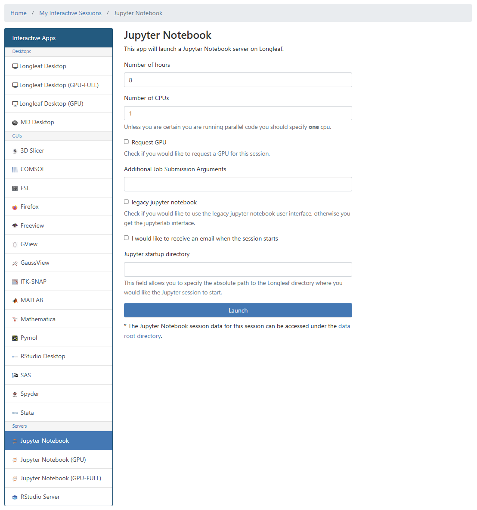

# Getting started with Longleaf (UNC research computing)

The Longleaf cluster is a Linux-based computing system available to researchers at UNC free of charge. In this course we will use Longleaf to run Python code in Jupyter notebooks.

<h2>Glossary:</h2>

**Python:** a popular computer language for science, data science, and general use.

**Jupyter notebook:** an interactive file that can display notes (markdown) and run python code.

**Longleaf:** UNC research computing compute cluster. (aka: a super computer accessible to UNC researchers)

**Longleaf On Demand:** a user-friendly web-portal that provides a graphical interface for apps including Jupyter.

## Request a Longleaf account

Request an account by following these steps:

1) Go to [help.unc.edu](help.unc.edu) and log in with your onyen.
2) Search for **Compute Cluster Access** in the catalog section of [help.unc.edu](help.unc.edu).
3) Click on **Computer Cluster Access**.
4) Click "Request Access" to complete the service request form and submit.

    

You will be notified by email when your account is ready.

Request a Longleaf account at: https://help.rc.unc.edu/request-a-cluster-account/

## Access Jupyter via Longleaf On Demand

Once your account is approved you will be able to access Longleaf. There are many ways to access Longleaf but for this course we will be using Longleaf On-Demand.

1) Got to [https://ondemand.rc.unc.edu/pun/sys/dashboard](https://ondemand.rc.unc.edu/pun/sys/dashboard).
2) Sign in using your onyen. 
3) Click on "Jupyter Notebook"
4) Request resources and click "Launch".

    

5) Wait for resources to be allocated to you (~1-2 minutes).
6) Click "Connect to Jupyter".
7) In the **Launcher** under the section **Notebook**, click "Python3 (ipkernel)" to open a notebook running Python.

    
