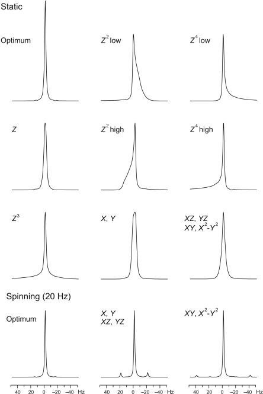

# Weekly nitrogen fill

author: Seth Veenbaas

last updated: 9/25/24

_____

Fills are performed weekly for all magnets. Without regular nitrogen fills the helium will boil-off rapidly causing the magnet to quench.

Typical fill schedule.
| Day       | Magnet(s)     |
| --------- | ------------- |
| Monday    | Neo400, 400NB |
| Wednesday | Neo600, 500   |
| Friday    | B600          |

## Prepare to fill

1. Start iLabs session.
2. Stop runs.

    **Magnets on manual mode**:
    * Verify an experiment is not running 

    **Magnets on automation**:
    * `pause` automation in Icon.
    * When all samples are complete, `stop` automation in Icon.

## Fill

1. Move suitible liquid nitrogen dewar to magnet.
    * < 22 psi (vent for ~1 min. if pressure is high)
    * Install transfer line to the liquid value on the dewar (no ferreous tools within the 5 gauss line)
2. Place cover over magnet bore (**N/A: Magnets on automation**)
3. Lower magnet legs by releasing the nitrogen gas pressure. (**N/A: 400NB**)
4. Remove condenser from the nitrogen ports. 
5. Install rubber tubes onto vent ports. 
6. Flush transfer line with nitrogen. 
7. Install transfer line to fill port.
8. Support the transfer line with a glove and slowly open value until liquid is flowing.
9. Adjust the liquid value on the dewar as nessecary to maintain flow rate.
10. When the magnet is full of nitrogen, close the liquid value on the dewar. 
11. Replace condenser on the fill port. 
12. Replace condenser(s) on the vent port(s). 
13. Remove cover from magnet bore. (**N/A: Magnets on automation**)
14. Raise magnet legs by reconnecting the nitrogen gas. (**N/A: 400NB**)

Notes:
* Fills usually take 30-45 minutes.
* Stay nearby to monitor fill progress

## Lineshape

1. Open TopShim
2. Inject lineshape sample (**1% CHCl3 in Acetone**)

    **Magnets on manual mode**:
    * `ej` Eject sample.
    * Check for air pressure
    * load sample
    * `ij` Inject sample.

    **Magnets on automation**:
    * load sample in sample changer and note position <#>.
    * `sx <#>` Inject sample from position <#>.

2. `rsh <probe>` Read the shim file for the probe.

    | Probe   |       Magnet        |
    | ------- | :-----------------: |
    | bbfo    | Neo400, 400NB, B600 |
    | bbo     |         500         |
    | cryoqnp |       Neo600        |

3. Use the browser to locate the `\data\numrsu` directory.
4. Right click the directory and `sort by date`
5. Drag the latest `lineshape-<DATE>` file into the main window.
6. `new` Create a new experiment.
7. Use the pop-up window to adjust experiment settings:

    | Field             |       Value       |
    | :---------------- | :---------------: |
    | Filename          | lineshape-\<DATE> |
    | Experiment number |         1         |
    | Use current param |        ✓         |
    | Solvent           |      Acetone      |

8. `lock acetone` Lock magnetic field to solvent.
9. `atma` Automatically tune and match probehead.
    * **Neo600**: `wobb` Manual tune and match.

10. `topshim gui` Shim magnet using graphical interface.

    | Field        | Standard value  |     Neo400      | Cryo or Neo probes |
    | ------------ | :-------------: | :-------------: | :----------------: |
    | Dimension    |       1D        |       1D        |         1D         |
    | Optimization | Solvent default | Solvent default |  Solvent default   |
    | Tune before  |  z-x-y-xz-yz-z  |  z-x-y-xz-yz-z  |   z-x-y-xz-yz-z    |
    | Tune after   |  z-x-y-xz-yz-z  |       off       |   z-x-y-xz-yz-z    |
    | parameters   |       off       |    convcomp     |      convcomp      |

    * **Neo400**: perform tune after in topshim gui

        | Field      |    Neo400     |
        | ---------- | :-----------: |
        | Tune after | z-x-y-xz-yz-z |
        | Only       |      ✓       |

11. Close the topshim gui window.
12. `getprosol` Reads the probeheads and solvent dependent parameters. 
13. `rga` Optimize reciever gain.
14. `zg` Start acquiring raw data (`go zero`).
15. `fp` FT and phase correction.
16. `apk` Automatic phase correction.
17. Check spectrum for peak symmetry.

    

18. `humpcal` Perform hump test.
19. Use logbook to determine if hump test is within the normal operating window.

    **Pass hump test**:
    * Document hump test in logbook:

        `<date> <initials> N2 fill <small#> <#> <large#> Hz`
    
    **Fail hump test**:
    * `wsh temp_<DATE>` Temporarily save the current shim settings in case you need to revert settings.
    * `topshim gui` Rerun topshim.
     
        | Issue                    | Optimization      |
        | ------------------------ | ----------------- |
        | Peak wide at half-height | `lineshape width` |
        | Peak wide at base (hump) | `lineshape hump`  |
    
    **Fail hump test multiple times**:
    * 3D shim using 10% H2O in D2O

20. `new` and copy experiment name.
21. `wsh <EXPERIMENT-NAME>`

## Chloroform sample

1. Inject chloroform sample (**1% Ethylbenzene in Chloroform**)

    **Magnets on manual mode**:
    * `ej` Eject sample.
    * Check for air pressure
    * load sample
    * `ij` Inject sample.

    **Magnets on automation**:
    * load sample in sample changer and note position <#>.
    * `sx <#>` Inject sample from position <#>.

2. Use the browser to locate the `\data\numrsu` directory.
3. Right click the directory and `sort by date`
4. Drag the latest `CDCl3-<DATE>` file into the main window.
5. `new` Create a new experiment.
6. Use the pop-up window to adjust experiment settings:

    | Field             |     Value     |
    | :---------------- | :-----------: |
    | Filename          | CDCl3-\<DATE> |
    | Experiment number |       1       |
    | Use current param |      ✓       |
    | Solvent           |     CDCl3     |

7. `lock cdcl3` Lock magnetic field to solvent.
8. `atma` Automatically tune and match probehead.
    * **Neo600**: `wobb` Manual tune and match.

9. `topshim` 1D shim.
10. `getprosol; rga; zg` Reads parameters; reciever gain; aquire data. 
11. `fp; apk` FT; phase correction.
12. Check spectrum for peak symmetry.
13. Verify that the peak width at half-height is < 0.8 Hz
14. `wsh <probe>`

    | Probe   |       Magnet        |
    | ------- | :-----------------: |
    | bbfo    | Neo400, 400NB, B600 |
    | bbo     |         500         |
    | cryoqnp |       Neo600        |

15. Remove samples and resume normal operation.

    **Magnets on manual mode**:
    * `ej` Eject sample.

    **Magnets on automation**:
    * `sx ej` Eject sample.
    * `start` Resume automation in Icon.

16. Finish ilabs session.