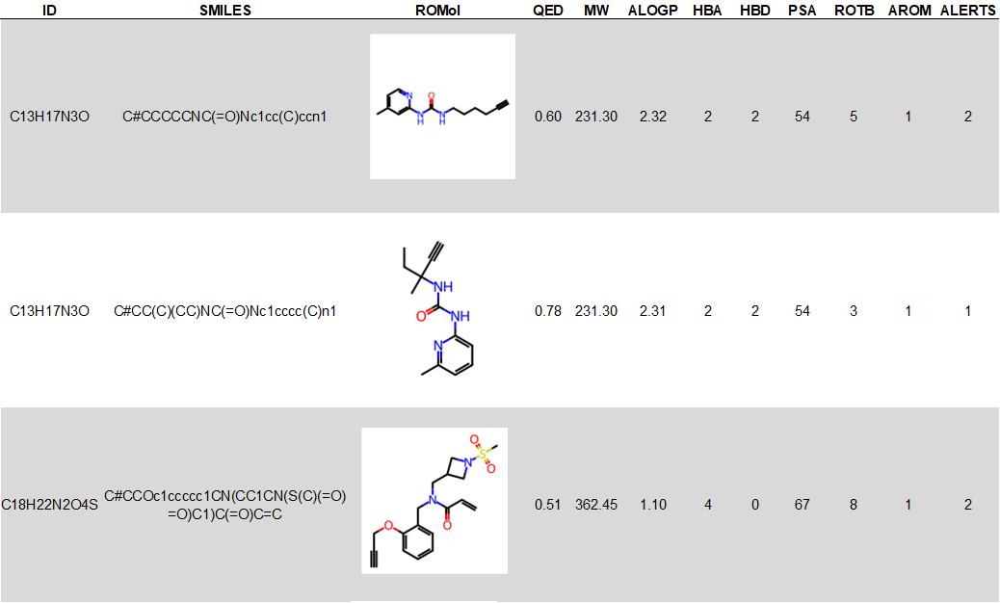

# Calculate QED Scores with calculateQED.py

Seth Veenbaas 2024

## Purpose

Calculate a QED score and properties related to drug-likeness from a .sdf structure file or a .csv file containing a SMILES structure.

## Installation

### Option 1: Install `nmr` conda environment with provided .yml file

1. Install `nmr` conda environment

        cd <path-to-NMR_core-repository>
        conda create -f nmr_enviroment.yml

1. Add rdkit scripts to the PATH within your conda environment
 
        cd rdkit
        conda develop .

### Option 2: Manually install dependencies

  * rdkit
  * xlsxwriter
  * pandas=2.1
  * pyarrow

## Input file formats

### SDF files
* Input .sdf files can be made in ChemDraw by saving as MDL SDfile V3000 (*.sdf).
* All chemical structures in the inputted SDF files will be analyzed.

### CSV files (SMILES)
* Input .csv files must contain a column containing SMILES strings.
    * The column containing the SMILES string must have a title containing the word "SMILES" (e.g. \*SMILES\*) 

* Generating SMILES:
    * SMILES can be obtained using PubChem, Wikipedia, Chemdraw, ect.
    * SMILES can be generated from ligands in the PDB by using the [Create Custom Report option](https://www.rcsb.org/news/5f6529e207302466657ec0e9) and exported in a .csv.

## Arguments

### Required (one of the following):

    -d (--directory): Path to a directory containing input .sdf files.
    -csv (--csv): Path to .csv file. Must contain a SMILES string in a column titled "SMILES".
    -sdf (--sdf): Path to an input .sdf file.

### Optional:

    -o (--out'): Path to output directory. (Default=directory of input file)
    -p (--properties): Adds QED properties to outputs (e.g. 'MW', 'ALOGP', 'HBA', 'HBD', 'PSA', 'ROTB', 'AROM', 'ALERTS'). (Default=False)
    -md (--moldescriptors): Adds QED properties to outputs (e.g. 'Num Ring', 'Frac Sp3', 'MR'). (Default=False)
    -g (--geometry): Adds molecule geometry to outputs (e.g. 'NPR1', 'NPR2', 'Geometry') (Default=False)

## Usage examples

### Activate rdkit conda environment before running

    activate rdkit

### Calculate QED score and QED properties from a .csv file

    python calculateQED.py --csv example_inputs/test_smiles.csv --out example_outputs -p

### Calculate SMILES, QED score, QED properties, moldescriptors, and geometry from a .sdf file

    python calculateQED.py --sdf example_inputs/test_library.sdf --out example_outputs -p -md -g

## Output files

1. .XLSX file (Excel)
    * ID
    * SMILES
    * Molecule image
    * QED score
    * QED properties (optional)
    * Molecular properties (optional)
    * Geometric properties (optional)

2. .HTML file
    * ID
    * SMILES
    * Molecule image
    * QED score
    * QED properties (optional)
    * Molecular properties (optional)
    * Geometric properties (optional)
  
3. .SDF file
    * Molecular structure coordinates
    * ID
    * SMILES
    * QED score
    * QED properties (optional)
    * Molecular properties (optional)
    * Geometric properties (optional)
  

